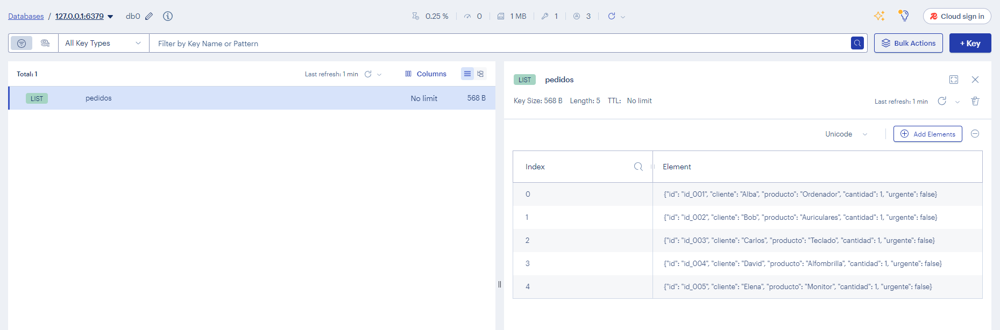
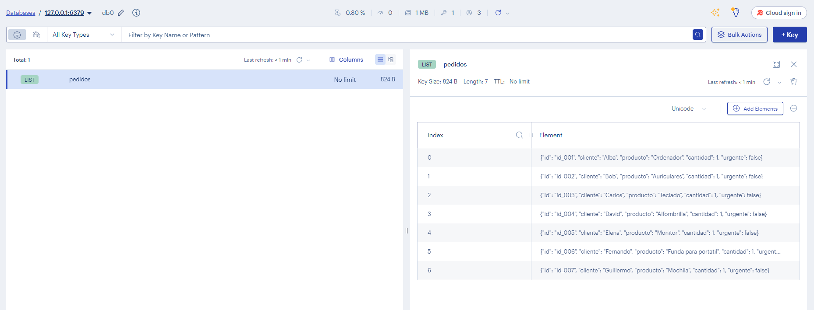
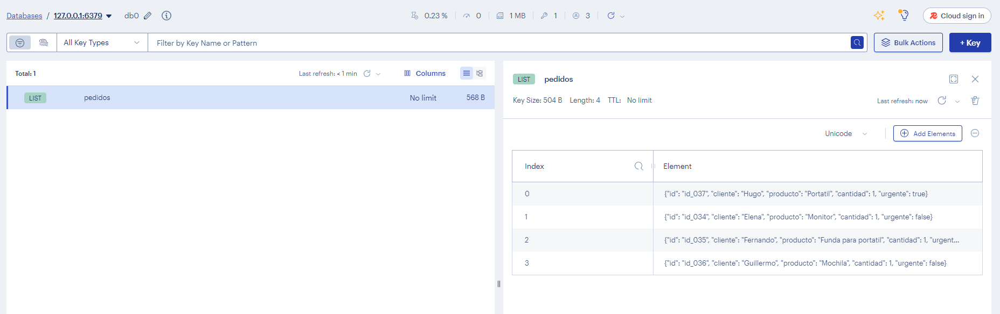

```python
import redis
import json

r = redis.Redis(
    host="redis",
    port=6379,
    db=0,
    decode_responses=True
)
```


```python
numero_pedido = 1

def siguiente_id():
    global numero_pedido
    id = "id_" + str(numero_pedido).zfill(3)
    numero_pedido += 1
    return id
```


```python
# 2. Función agregar_pedido
def agregar_pedido(cliente, producto, cantidad=1, urgente=False):
    pedido = {
        "id": siguiente_id(),
        "cliente": cliente,
        "producto": producto,
        "cantidad": cantidad,
        "urgente": urgente
    }
    pedido_json = json.dumps(pedido)
    
    if (urgente==False):
        r.rpush("pedidos", pedido_json)
    else:
        r.lpush("pedidos", pedido_json)
```


```python
# 5. Función procesar_pedido
def procesar_pedido():
    pedido_para_procesar = r.lpop("pedidos")
    pedido_diccionario = json.loads(pedido_para_procesar)
    print("Pedido procesado: " + str(pedido_diccionario))
```


```python
# 6. Agregar cinco pedidos
agregar_pedido("Alba", "Ordenador")
agregar_pedido("Bob", "Auriculares")
agregar_pedido("Carlos", "Teclado")
agregar_pedido("David", "Alfombrilla")
agregar_pedido("Elena", "Monitor")
```


```python
# 7. Mostrar toda la lista de pedidos
print(r.lrange("pedidos", 0, -1))
```

    ['{"id": "id_001", "cliente": "Alba", "producto": "Ordenador", "cantidad": 1, "urgente": false}', '{"id": "id_002", "cliente": "Bob", "producto": "Auriculares", "cantidad": 1, "urgente": false}', '{"id": "id_003", "cliente": "Carlos", "producto": "Teclado", "cantidad": 1, "urgente": false}', '{"id": "id_004", "cliente": "David", "producto": "Alfombrilla", "cantidad": 1, "urgente": false}', '{"id": "id_005", "cliente": "Elena", "producto": "Monitor", "cantidad": 1, "urgente": false}']


```python
# 8. Agregar dos pedidos más
agregar_pedido("Fernando", "Funda para portatil")
agregar_pedido("Guillermo", "Mochila")
```


```python
# 9. Procesar todos los pedidos uno por uno
procesar_pedido()
procesar_pedido()
procesar_pedido()
procesar_pedido()
procesar_pedido()
procesar_pedido()
procesar_pedido()
```

    Pedido procesado: {'id': 'id_045', 'cliente': 'Alba', 'producto': 'Ordenador', 'cantidad': 1, 'urgente': False}
    Pedido procesado: {'id': 'id_046', 'cliente': 'Bob', 'producto': 'Auriculares', 'cantidad': 1, 'urgente': False}
    Pedido procesado: {'id': 'id_047', 'cliente': 'Carlos', 'producto': 'Teclado', 'cantidad': 1, 'urgente': False}
    Pedido procesado: {'id': 'id_048', 'cliente': 'David', 'producto': 'Alfombrilla', 'cantidad': 1, 'urgente': False}
    Pedido procesado: {'id': 'id_049', 'cliente': 'Elena', 'producto': 'Monitor', 'cantidad': 1, 'urgente': False}
    Pedido procesado: {'id': 'id_050', 'cliente': 'Fernando', 'producto': 'Funda para portatil', 'cantidad': 1, 'urgente': False}
    Pedido procesado: {'id': 'id_051', 'cliente': 'Guillermo', 'producto': 'Mochila', 'cantidad': 1, 'urgente': False}


```python
# 10. Agregar un pedido urgente y procesarlo el primero
agregar_pedido("Hugo", "Portatil", urgente=True)
```


```python
procesar_pedido()
```

    Pedido procesado: {'id': 'id_037', 'cliente': 'Hugo', 'producto': 'Portatil', 'cantidad': 1, 'urgente': True}

