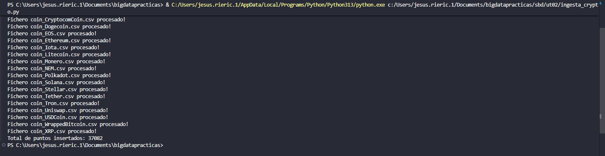

```python
import os
import csv
import influxdb_client
from influxdb_client.client.write_api import SYNCHRONOUS, ASYNCHRONOUS
from influxdb_client import WriteOptions, Point, WritePrecision
from influxdb_client.client.exceptions import InfluxDBError
from urllib3.exceptions import NewConnectionError
from datetime import datetime, timezone


# - - - CLIENTE - - -
INFLUX_URL = "http://localhost:8086"
INFLUX_TOKEN = "Villabalter1"
INFLUX_ORG = "docs"

cliente = None
write_api = None

try:
    cliente = influxdb_client.InfluxDBClient(
        url = INFLUX_URL,
        token = INFLUX_TOKEN,
        org = INFLUX_ORG
    )

except (InfluxDBError, NewConnectionError) as e:
    print("[ERROR] Error al conectar con InfluxDB")


# - - - WRITEAPI - - -
write_options = WriteOptions(
    batch_size = 5000,
    flush_interval = 1000,
    write_type = ASYNCHRONOUS
)

write_api = cliente.write_api(write_options = write_options)


# - - - CONVERTIR FECHA - - -
def convertir_fecha(date):
    dt = datetime.strptime(date, "%Y-%m-%d %H:%M:%S")
    dt_utc = dt.replace(tzinfo=timezone.utc)
    return dt_utc

# - - - LECTURA - - -
contador_puntos = 0

ficheros = os.listdir("sbd/ut02/data/crypto_files/")

for fichero in ficheros:
    ruta = os.path.join("sbd/ut02/data/crypto_files/", fichero)

    # Creo una lista con todos los puntos que voy a escribir
    puntos_batch = []

    with open(ruta, mode="r", encoding="utf-8") as ficherocsv:
        reader = csv.reader(ficherocsv)
        next(reader)

        for fila in reader:
            symbol = fila[1]
            name = fila[2]
            date = convertir_fecha(fila[3])

            high_p = float(fila[4])
            low_p = float(fila[5])
            open_p = float(fila[6])
            close_p = float(fila[7])
            volume_p = float(fila[8])
            marketcap_p = float(fila[9])

            punto = (
                Point("daily_quote")
                .tag("symbol", symbol)
                .tag("name", name)
                .time(date, WritePrecision.NS)
                .field("high", high_p)
                .field("low", low_p)
                .field("open", open_p)
                .field("close", close_p)
                .field("volume", volume_p)
                .field("marketcap", marketcap_p)
            )

            puntos_batch.append(punto)            
            contador_puntos += 1

    # Escribo todos los puntos de la lista de una sola vez, porque sino tardaba mucho tiempo 
    write_api.write(bucket="crypto_raw", record=puntos_batch) 
    print(f"Fichero {fichero} procesado!")

write_api.close()
cliente.close()

print(f"Total de puntos insertados: {contador_puntos}")
```



[**ingesta_crypto.py**](./ingesta_crypto.py)
